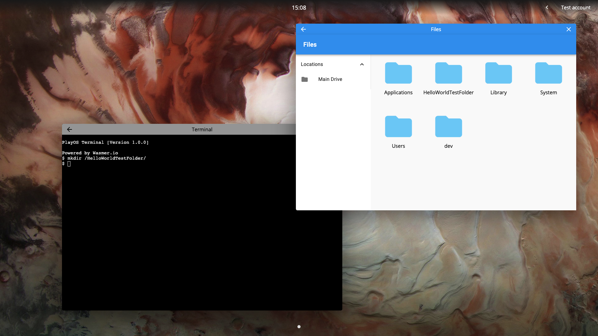

#  - Web Operating System 🚀

PlayOS gives users an easy way to access their apps, games, storage, data, notifications and more. It is accessible from any device that has an internet browser. This allows you to pick up from any app where you left off. This is done by synchronizing the state between devices. Giving users a seamless experience.
 
PlayOS allows applications to communicate with each other in a sandboxed environment. This way apps can be integrated with each other, without building the infrastructure for it. Take for example the files app. It allows users to click on the file and choose which app to give access to that specific file/folder.

PlayOS can be integrated with any storage/server architecture there is through providers.

We are still porting code over to a provider based manner, any help is greatly appreciated.

## ⚙️ Running PlayOS
```npm i && npm start```

PlayOS will be available at `http://localhost:3000/`

## 🔌 Providers

PlayOS is based on providers. It allows you to switch backends where needed. This way you can couple PlayOS to Dropbox, Amazon, Azure or even a decentralized solution such as Ethereum. We want you to be able to choose where to use PlayOS.

All execution is done on the client. Providers should only provide basic functionality such as file storage. Our default provider is based on Rutile which can be forked and be privatly used.

## 📝 Contributing to PlayOS

We accept contributions to the repository. Feel free to fork and send in a PR. You can check the issues for any known tasks (or add your own).


